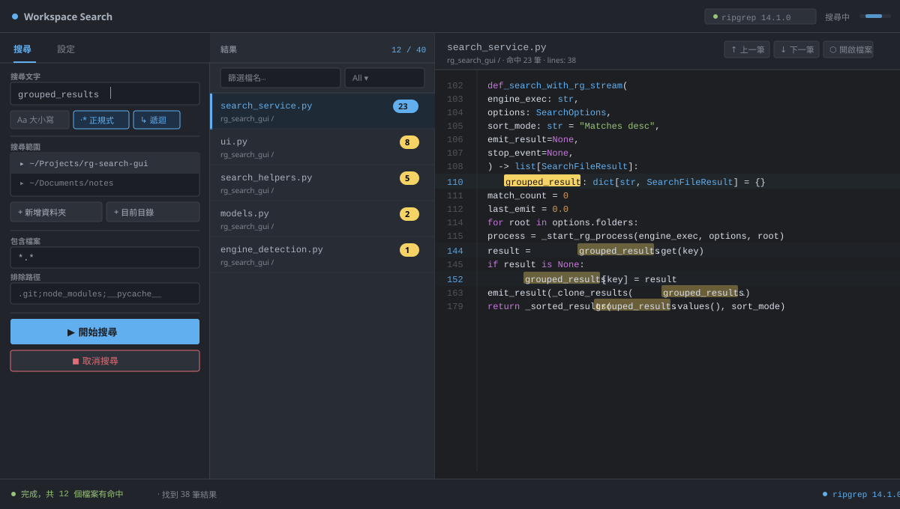
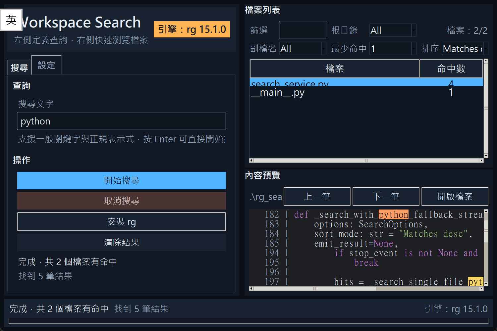
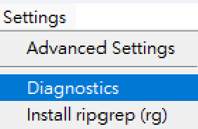
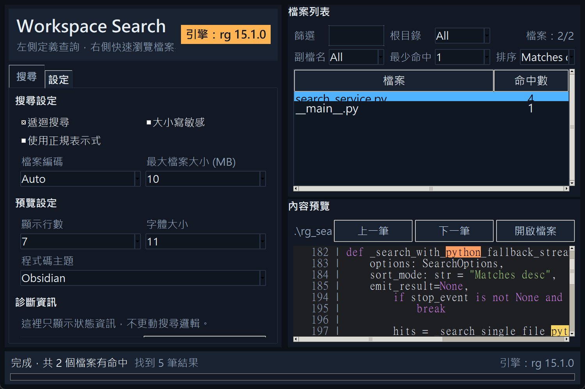

# RG Search GUI

> A practical Windows desktop search GUI powered by `ripgrep`.
> Search multiple folders, filter files, stream results, and preview matches without living in the terminal.

Maintained by `Javalight`.
This project is an independent GUI tool and is not affiliated with or endorsed by the `ripgrep` project.

## Traditional Chinese Quick Start

If you prefer Traditional Chinese documentation, start here:

- Overview: [docs/zh-TW/README.md](docs/zh-TW/README.md)
- User manual: [docs/zh-TW/usage-guide.md](docs/zh-TW/usage-guide.md)

Quick launch on Windows:

```text
run_rg_search_gui.bat
```

Or launch by module:

```bash
python -m rg_search_gui
```

Quick links:
- [User guide](docs/user-guide.md)
- [Traditional Chinese guide](docs/zh-TW/README.md)
- [Traditional Chinese user manual](docs/zh-TW/usage-guide.md)

## Preview



*Obsidian-themed three-panel layout: search sidebar on the left, matched files in the middle, and syntax-highlighted code preview on the right.*

## Screenshots



*Use a VS Code-style workspace layout: search on the left, matched files on the upper right, and preview on the lower right.*



*The `設定` entry can still jump to diagnostics or the install flow, while the main configuration now lives in the left sidebar tabs.*



*Switch between `搜尋` and `設定` in the left sidebar without leaving the current results view.*

## Why It Exists

RG Search GUI is for developers who want `rg`-style search speed with a repeatable desktop workflow.
It is built for the common cases where opening a GUI is faster than rebuilding the same terminal command over and over.

## Highlights

- Search across multiple folders
- Include / exclude file patterns
- Case-sensitive and regex search
- Stream results while searching
- Preview hits with lightweight syntax highlighting
- VS Code-inspired split layout with a dedicated left search sidebar
- Auto-detect `rg` on Windows
- Prompt to install `rg` with live `winget` logs when it is missing
- Use a portable Windows launcher that does not hardcode a local Python path

## Quick Start

### Option 1: Installed command

```bash
pip install -e .
rg-search-gui
```

### Option 2: Module launch

```bash
python -m rg_search_gui
```

### Option 3: Windows launcher

Run `run_rg_search_gui.bat`.
The launcher tries `py` first, then `python` from `PATH`.

## Good Fit

- Search across project folders without opening a terminal every time
- Inspect logs and config files quickly
- Scan multiple script directories for a keyword or regex
- Review matched lines with context before opening the file

## Requirements

- Python 3.10+
- Windows is the primary target environment
- `ripgrep` is recommended for the best performance

## Project Status

- Public MVP
- Windows-first
- Source-first release
- `.exe` release can be added later

## Repository Layout

```text
.
├─ rg_search_gui/
│  ├─ __init__.py
│  ├─ __main__.py
│  ├─ engine_detection.py
│  ├─ installer_service.py
│  ├─ main.py
│  ├─ models.py
│  ├─ search_helpers.py
│  ├─ search_service.py
│  ├─ settings_service.py
│  └─ ui.py
├─ docs/
│  ├─ assets/
│  │  ├─ search-result.png
│  │  ├─ search-settings-dialog.png
│  │  └─ settings-menu.png
│  ├─ maintainers/
│  │  ├─ github-topics.md
│  │  └─ release-template.md
│  ├─ user-guide.md
│  └─ zh-TW/
│     ├─ README.md
│     ├─ rg-search-gui-spec.md
│     └─ usage-guide.md
├─ README.md
├─ CHANGELOG.md
├─ CONTRIBUTING.md
├─ LICENSE
├─ pyproject.toml
└─ run_rg_search_gui.bat
```

## Module Guide

- `run_rg_search_gui.bat`: Windows launcher that starts the app with `py` or `python` from `PATH`
- `rg_search_gui/__main__.py`: module entry point for `python -m rg_search_gui`
- `rg_search_gui/main.py`: lightweight app launcher that calls the Tkinter UI entry
- `rg_search_gui/ui.py`: Tkinter UI, search workflow coordination, preview rendering, and user actions
- `rg_search_gui/models.py`: shared data models for search options, hits, results, context lines, and engine info
- `rg_search_gui/search_service.py`: search execution with `rg`, `grep`, and Python fallback helpers
- `rg_search_gui/search_helpers.py`: filtering, sorting, preview context, match spans, and lightweight syntax highlight helpers
- `rg_search_gui/engine_detection.py`: detect the available search engine executable and version
- `rg_search_gui/installer_service.py`: Windows `winget` install flow for `ripgrep`
- `rg_search_gui/settings_service.py`: load and save persisted user settings

## Search Flow

1. Start the app with `run_rg_search_gui.bat`, `python -m rg_search_gui`, or the installed `rg-search-gui` command.
2. The UI loads persisted settings and detects whether `rg`, `grep`, or no engine is available.
3. The user selects folders and enters the search text from the left `搜尋` tab, then switches to the left `設定` tab if regex, encoding, preview theme, or file size limits need adjustment.
4. The UI builds a `SearchOptions` payload and starts the search in a background thread so the window stays responsive.
5. `search_service.py` runs `rg --json` when available, or falls back to `grep` / Python helpers, then streams grouped matches back to the UI.
6. The UI refreshes the upper-right file list, lower-right preview panel, filters, and summary fields while the search is running and after it completes.

## Packaging Notes

For a public MVP, keep the repository source-first.
Do not ship `__pycache__` or `*.pyc` files.
If you later want a broader non-technical audience, add a GitHub Release with a Windows `.exe` build.

## Additional Docs

- User guide: [docs/user-guide.md](docs/user-guide.md)
- Traditional Chinese guide: [docs/zh-TW/README.md](docs/zh-TW/README.md)
- Traditional Chinese user manual: [docs/zh-TW/usage-guide.md](docs/zh-TW/usage-guide.md)
- Historical source bundle / reference notes: [docs/zh-TW/rg-search-gui-spec.md](docs/zh-TW/rg-search-gui-spec.md)
- Maintainer notes: [docs/maintainers/](docs/maintainers/)

## License

[PolyForm Noncommercial 1.0.0](LICENSE) — 個人使用、研究、教育用途免費；**禁止商業使用**。

## Contributing

See [CONTRIBUTING.md](CONTRIBUTING.md) for the minimal contribution workflow.
