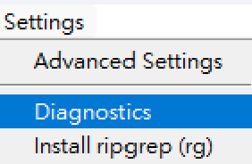
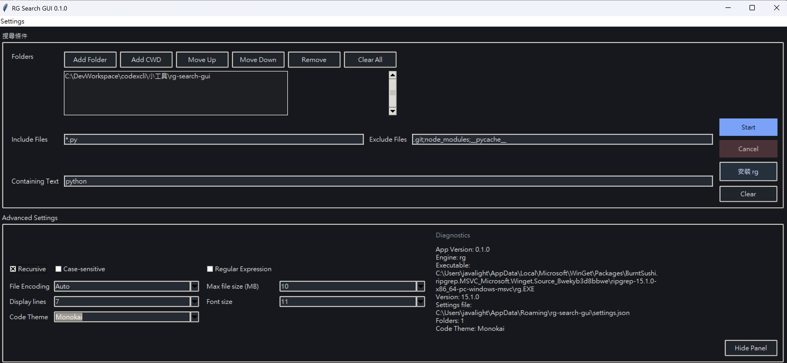

# 操作手冊

這份手冊是給第一次使用 `RG Search GUI` 的使用者。
重點不是講架構，而是讓你可以快速啟動、搜尋、排錯。

## 1. 使用前準備

- Windows
- Python 3.10 以上
- 建議安裝 `ripgrep (rg)` 以獲得較好的搜尋速度

## 2. 啟動方式

### 方式 1：Windows 啟動器

直接執行：

```text
run_rg_search_gui.bat
```

這個啟動器會先找 `py`，再找 `python`，不會綁死本機的絕對路徑。

### 方式 2：直接以模組啟動

```bash
python -m rg_search_gui
```

### 方式 3：安裝後啟動

```bash
pip install -e .
rg-search-gui
```

## 3. 第一次搜尋

建議第一次先做最小驗證：

1. 啟動程式
2. 在 `Folders` 加入一個小型資料夾
3. 在 `Containing Text` 輸入一個明確關鍵字
4. 按 `Start`
5. 確認左側有結果，右側可看到命中內容預覽

## 4. 主要欄位說明

### Folders

要搜尋的資料夾清單。可以加入多個資料夾。

### Include Files

用來限制搜尋哪些檔案，例如：

```text
*.py;*.md
```

### Exclude Files

用來排除資料夾或檔案，例如：

```text
.git;node_modules;__pycache__
```

### Containing Text

要搜尋的關鍵字或樣式。這是必要欄位，不能為空。

### Recursive

勾選後會遞迴搜尋子資料夾。

### Case-sensitive

勾選後會區分大小寫。

### Regular Expression

勾選後會把 `Containing Text` 視為 regex。

### File Encoding

預設是 `Auto`。如果你知道目標檔案編碼，可以手動指定，例如 `utf-8` 或 `cp950`。

### Max file size (MB)

限制單一檔案最大搜尋大小。對大型資料夾很有用。

## 5. `rg` 安裝流程

如果程式啟動搜尋時找不到 `rg`，會跳出視窗問你要不要安裝。

安裝流程重點：

- 會優先使用 `winget`
- 會顯示安裝日誌視窗
- 若已安裝但沒有可升級版本，也會視為可用

你也可以手動按右側的 `安裝 rg` 按鈕，或從 `Settings` 選單安裝。

## 6. 設定與診斷

當你要調整搜尋行為，或確認目前偵測到的搜尋引擎狀態時，可以使用 `Settings` 選單。



### 選單項目

- `Advanced Settings`：在主畫面切換內嵌的設定面板
- `Diagnostics`：展開同一塊面板，並刷新目前偵測到的引擎、執行檔路徑、版本、設定檔位置與資料夾數量
- `Install ripgrep (rg)`：手動觸發 Windows `winget` 安裝流程



### Advanced Settings 欄位

- `Recursive`：是否遞迴搜尋子資料夾
- `Case-sensitive`：是否區分大小寫
- `Regular Expression`：是否把搜尋文字視為 regex
- `File Encoding`：使用 `Auto` 或指定編碼，例如 `utf-8`、`cp950`
- `Max file size (MB)`：略過過大的檔案
- `Display lines`：控制預覽時顯示的上下文行數
- `Font size`：調整表格與預覽區字體大小

設定面板會留在主畫面裡，因此你可以一邊調整，一邊保留目前結果畫面；程式仍會在正常流程中自動保存設定。

## 7. 搜尋結果畫面

### 左側結果區

- 顯示有命中的檔案
- 可依檔名、root、副檔名、命中數量過濾
- 可排序

### 右側預覽區

- 顯示命中的內容與上下文
- 支援前後命中切換
- 可直接開啟目前檔案

## 8. 設定檔位置

程式會自動保存設定。

Windows 預設位置：

```text
%APPDATA%\rg-search-gui\settings.json
```

如果設定壞掉，最直接的處理方式是先刪除這個檔案，再重新啟動程式。

## 9. 常見問題

### 找不到 Python 啟動器

如果 `run_rg_search_gui.bat` 顯示找不到 Python，代表系統找不到 `py` 或 `python`。

處理方式：

1. 確認已安裝 Python 3.10+
2. 確認 `py` 或 `python` 可在終端機直接執行
3. 重新開新終端機或新視窗後再試一次

### 找不到 `rg`

這不一定是錯誤，只是目前機器沒安裝 `ripgrep`。

處理方式：

- 直接在 GUI 內按提示安裝
- 或手動用 `winget` 安裝

### 搜尋很慢

常見原因：

- 搜尋資料夾太大
- 未設定 exclude pattern
- 未限制檔案大小
- 沒有使用 `rg`

最小改善方式：

- 加入 `exclude` 規則
- 降低 `Max file size`
- 先縮小 `Folders` 範圍

### regex 沒結果

先確認：

- `Regular Expression` 是否有勾選
- regex 本身是否有效
- 是否被 `Include/Exclude` 規則過濾掉
